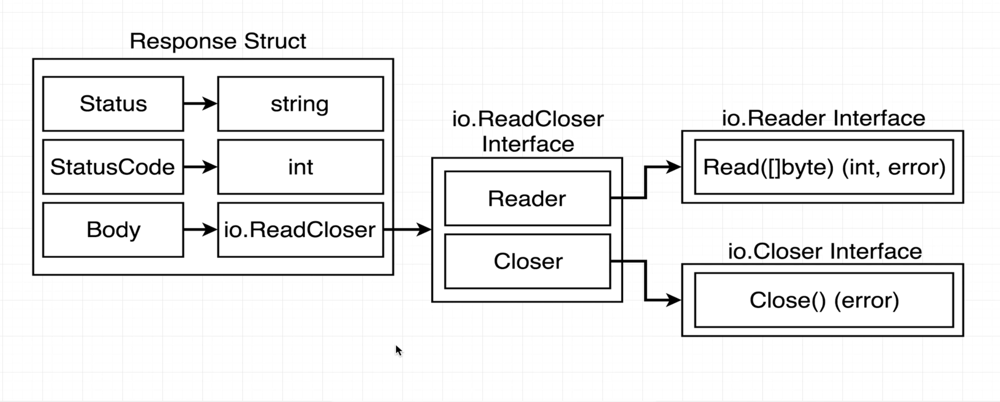
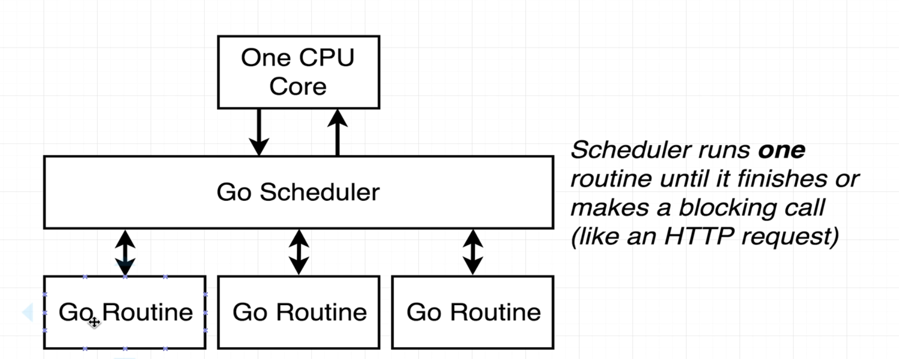
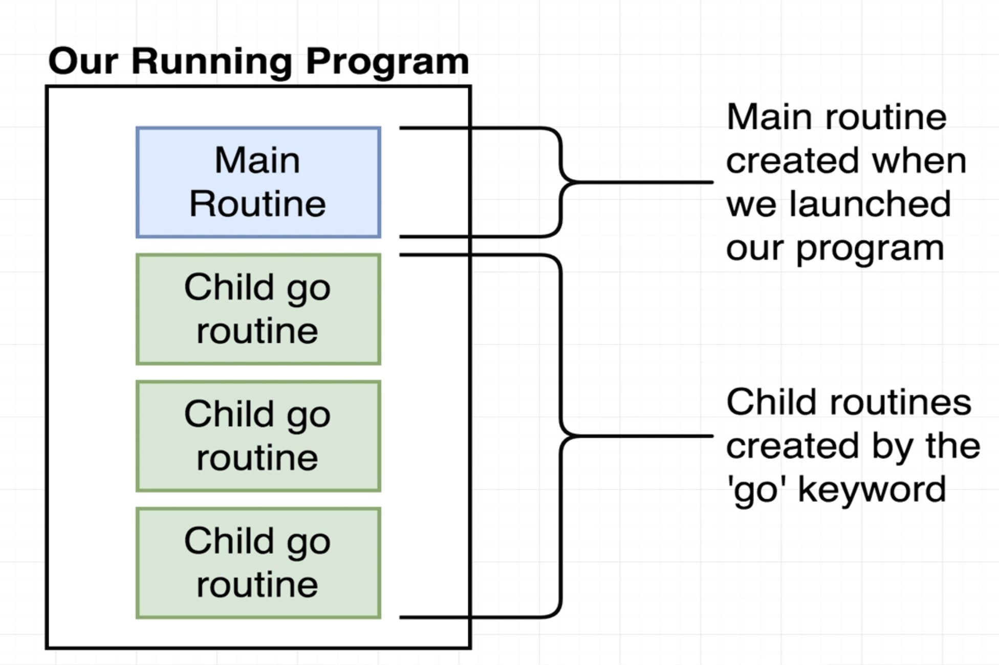
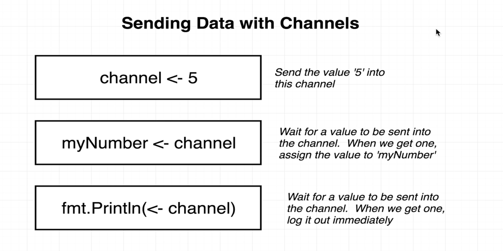

# Golang Notes

In golang:
- every value has a type
- every function has to specify the type of its arguments

### Interface
In Go, interfaces are a powerful way to define behavior. They allow us to specify a set of methods that a type must implement, without dictating how those methods should be implemented. This promotes flexibility and decouples the code, enabling polymorphism.

Key Concepts of Interfaces in Go:
- Definition: An interface is defined using the type keyword followed by the interface name and the method signatures it requires. For example:
```
   type Greeter interface {
       getGreeting() string
   }
```

- Implementation: Any type that implements the methods defined in an interface satisfies that interface. For instance, both `englishBot` and `spanishBot` implement the `getGreeting` method:

```
   func (eb englishBot) getGreeting() string {
       return "Hello There"
   }

   func (sb spanishBot) getGreeting() string {
       return "Hola"
   }
```

- Using Interfaces: You can use interfaces to write functions that can accept any type that implements the interface. For example, if you had a function that takes a `Greeter` interface:
```
   func printGreeting(g Greeter) {
       fmt.Println(g.getGreeting())
   }
```

- Polymorphism: This allows you to write more generic code. You can pass any type that implements the Greeter interface to the printGreeting function:
```
   eb := englishBot{}
   printGreeting(eb) // Outputs: Hello There

   sb := spanishBot{}
   printGreeting(sb) // Outputs: Hola
```   

In golang, there are concrete types and interface types
- Concrete types: 
    - built in types (`int`, `float`, `structs`, `map`)
    - Specified, defined type that has a fixed structure and behavior
    - memory is allocated for an instance of a type
    - can create variables of concrete types and use them directly


- Interface types: 
    - An interface type defines a set of method signature that a concrete type MUST implement
    - It doesn't provide any implementation
    - It specifies behavior without dictating how that behavior is implemented
    - Allows polymorphism by allowing functions to accept any type that implements the interface
    - *Interfaces are a contract to help us manage types*

#### An example of working with http interfaces

Inside `Response Struct`, the field `Body` can be of any type as long as it satisfies the `ReadCloser` interface.
The `Reader` interface allows us to read data from different sources, such as network connections or files, in a consistent manner. It provides a standard way to handle input streams, enabling us to process data without needing to know the underlying source.
Source of input (`https request body`, `text file`, `image` etc.) → Reader → `[]byte`(output data that anyone can work with)

### Go Routines and Channels


When we spawn multiple go routines inside of our program, there is a Go Scheduler that works with one CPU core of our local machine

- Although multiple go routines are launched, only one is being executed or running at any given time
- The scheduler runs the next go routine once it detects that a function has made a blocking call, or when the function has finished running all the code
- By default Go tries to use one core. It is concurrent, but doesn't perform parallelism.
- Concurrency: Multiple threads executing code, if one thread blocks another one is picked up and worked on. Simply stating, we can schedule work and kind of change them on the fly
- Parallelism: When multiple threads execute at the same time, requires multiple CPUs. Simply stating, we can perform multiple jobs at the same time



Channels are used to communicate in between different go routines. They can be thought of intermediates discussion or communication between all different running routines.
The information that is passed into a channel or the data attempted to share between different routines must be of the same type.


- Receiving a message via a channel is a blocking call (blocking operation, like HTTP GET)
- Never try to share variables between go routines. 
- Wherever possible, we only share information with a child routine, or a new Go Routine we create by passing that info as an argument